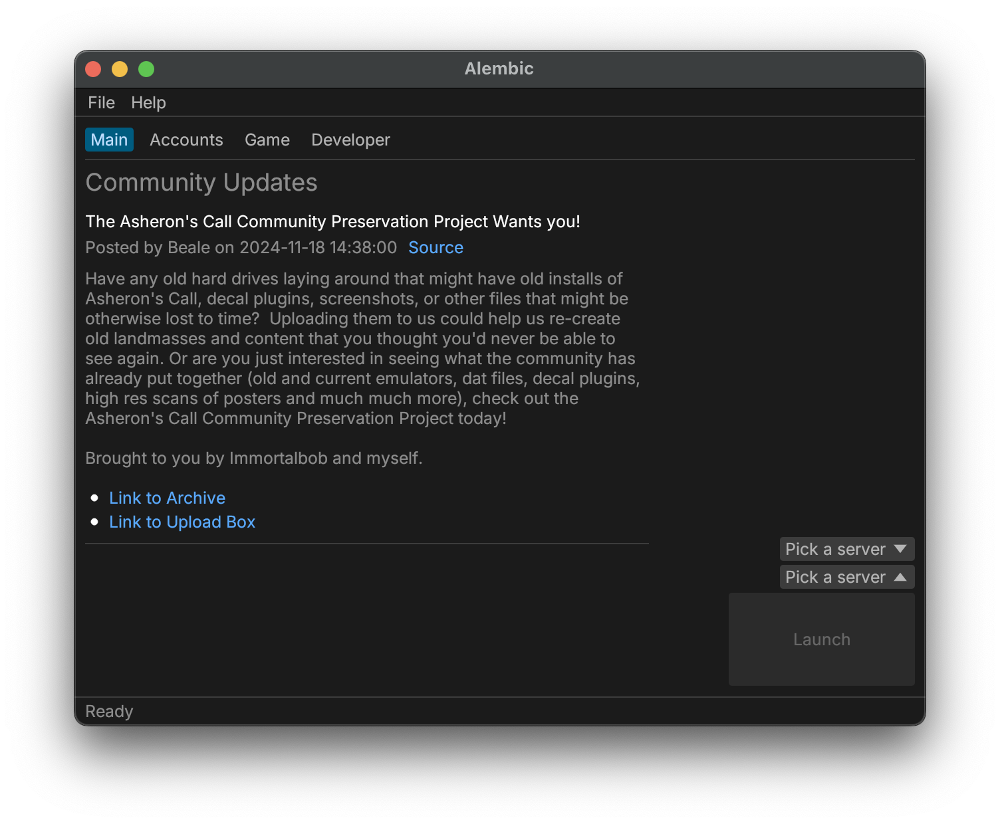

# Alembic


Tiny demonstration of using the [dll-syringe](https://github.com/OpenByteDev/dll-syringe/) and [retour-rs](https://github.com/Hpmason/retour-rs) to hook Asheron's Call client functions and [egui](https://www.egui.rs) to give all of that a UI.

Built for my curiosity.
This quickly got very out of hand.



See the [Alembic Walkthrough](https://www.youtube.com/watch?v=Q9_YcRT3qpg) to see how it works.

## Features

- [x] Desktop GUI written in [egui](https://www.egui.rs)
  - [x] Complete Servers and Accounts management UI
  - [x] Shows ingame chat
  - [x] Shows game client network activity
  - [x] Cross-platform support, though it only works fully on Windows
- [x] CLI for launching and injecting from the command line
- [x] Settings system for persisting
- [x] RPC system for communicating between the game client and the GUI/CLI. In theory, the game client could be injected locally but controlled remotely.
- [x] Client Hooks
  - [x] Chat
  - [x] Networking
- [x] NSIS-based installer

## Source Code

The project is managed as a single Cargo Workspace with four subcrates:

- **cli:** CLI for launching game clients and injecting
- **desktop:** Cross-platform egui desktop application for launching game clients and injecting
- **dll:**: Source for for the injected DLL. Windows-only.
- **libalembic:** Common and/shared functionality. Lots of code in here.

## Future Plans

- Initial release. I need to figure out what I consider a reasonable first release. If you'd like to help with testing, let me know.
- Improved network handling (i.e., convert/reassemble packets into game messages)
- Plugin system, e.g.,
  - Discord relay
  - Web server
- Refactor read-heavy shared state from Mutexes to RwLocks. Apparently this is better performance-wise.
- Hook up tracing/opentelemetry crates instead of the current spotty use of `println!`

### Prerequisites

This project is written in Rust and requires a nightly toolchain.

On Windows, you need the 32-bit MSVC target installed:

```sh
rustup target add i686-pc-windows-msvc
```

Install cargo-make for the build system:

```sh
cargo install cargo-make
```

## Building

The workspace contains six crates:

- `desktop`: Desktop GUI (written in egui) - builds for native architecture
- `cli`: Command-line interface - builds for native architecture
- `tui`: Terminal UI - builds for native architecture
- `cork`: DLL injector utility - **always builds as 32-bit (i686-pc-windows-msvc)**
- `dll`: The injectable DLL - **always builds as 32-bit (i686-pc-windows-msvc)**
- `libalembic`: Common library code, used in the above crates

### Quick Start

Use cargo-make to build everything:

```sh
# Build all components (32-bit and native)
cargo make build

# Run the desktop app
cargo run --bin desktop
```

The build task automatically:
1. Builds cork and dll for 32-bit Windows (i686-pc-windows-msvc)
2. Builds desktop and cli for your native architecture

### Manual Build

If you prefer to build manually:

```sh
# Build 32-bit components first
cargo build --target i686-pc-windows-msvc -p cork -p dll

# Then build native components
cargo build -p desktop -p cli
```

## Contributing

I'm open to contributions through filing issues, asking questions, or submitting pull requests.

Some good ways to contribute are:

- Help me with Rust: I was learning Rust while I wrote most of this so if you see things that could be improved, please let me know
- Improve data handling. For example, network messages aren't yet parsed into fragments or reconstructed into game messages.
- Make the UI nicer: For example, the packet UI could be way better.
